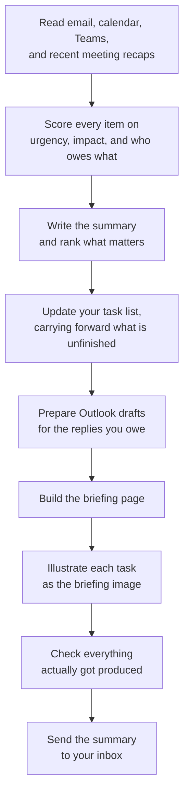

# ChiefOS

[Download the latest ChiefOS extension package](../../releases/latest/download/chief-os-latest.zip)

**A digital chief of staff for Microsoft 365. It reads your inbox, calendar, Teams
messages, and recent meeting recaps twice a day, tells you what actually matters, and
keeps your task list current so nothing important quietly slips.**

Most people start the day by scrolling. They open Outlook, skim thirty messages, glance
at the calendar, check Teams, reconstruct what recent meetings decided, and hope nothing
urgent is buried. It takes twenty minutes and still misses things.

This extension does that pass for you. At 7am it hands you a short briefing: what needs a
decision today, where your calendar conflicts, who is waiting on you, and what you should
do about each one. At 4pm it tells you what moved, what is still open, and what to
prepare for tomorrow.

---

## What you get

Twice a day, five things arrive together.

| Output               | What it is                                                                        |
| -------------------- | --------------------------------------------------------------------------------- |
| **The briefing**     | A one-page summary of your day, ranked by what needs you most                     |
| **Your task list**   | A running list of actions, carried forward until they are genuinely done          |
| **Draft replies**    | Outlook drafts prepared for the emails that need a response, saved but never sent |
| **A briefing image** | An illustrated poster of your day, one hand-drawn vignette and note per task      |
| **A summary email**  | The same briefing sent to you, so it is in your inbox wherever you are            |

### Morning Brief

Runs before noon. Answers: what needs a decision today, which meetings need preparation,
where the calendar clashes, what recent meetings committed you to, and who is waiting on
a reply.

### Afternoon Recap

Runs from noon onward. Answers: what got resolved, what is still open, what is now
overdue, what today's meetings changed, and what to prepare for tomorrow. It only surfaces
what changed, so it does not repeat the morning back at you.

---

## The five skills

The extension is deliberately small: five skills, each one something you would actually
ask for out loud.

| Skill                       | You would say                                   | What it does                                                                                                                                          |
| --------------------------- | ----------------------------------------------- | ----------------------------------------------------------------------------------------------------------------------------------------------------- |
| **chief-os-brief**          | "Give me my morning brief"                      | The whole daily routine, from reading your inbox to sending the summary email                                                                         |
| **chief-os-schedule**       | "Set up my daily runs"                          | Sets the two daily times. Run once, then forget about it                                                                                              |
| **chief-os-todo-complete**  | "Tick off the tasks I finished"                 | Lists your active tasks, asks which ones are done, then ticks them off in your task list                                                              |
| **chief-os-visual-minutes** | "Sketch out this meeting for me"                | Turns one meeting into a single illustrated page: the key moments along its timeline, and the follow-up actions that came out of it                   |
| **chief-os-image-prompt**   | "Use chief-os-image-prompt for a coastal scene" | Composes an illustration prompt in a named style, Everyday Doodle or Scientific Editorial. It returns the prompt and never generates the image itself |

**chief-os-brief** is the one that does the work. The other four exist because they are
genuinely separate things you might want: setting your schedule happens once at setup,
closing out tasks happens whenever you finish something, summarising a meeting is
something you want right after that meeting rather than at 7am tomorrow, and composing an
image prompt is useful outside a briefing entirely.

You can also ask for one part on its own, such as "triage my email" or "what is on my
calendar", without running the full routine.

---

## How a run works



The scoring in step two is the part that makes the output useful rather than just a list.
Every email, upcoming event, Teams thread, and completed-meeting outcome is scored on the
same five factors:

| Factor          | Weight | What it measures                              |
| --------------- | -----: | --------------------------------------------- |
| **Impact**      |     30 | What it costs the business if this is missed  |
| **Action**      |     25 | What you personally owe, right now            |
| **Urgency**     |     20 | What actually happens if it waits             |
| **Risk**        |     15 | The exposure or dependency sitting behind it  |
| **Stakeholder** |     10 | How closely the person is tied to the outcome |

One set of factors, one set of weights, every source. An email and a Teams message
describing the same situation land on the same score, which was not true when each source
carried its own scale.

Only evidence counts. A message is not important because the sender has a senior job
title or because the subject line says "URGENT". Scores decide the order only, and never
appear in anything you read.

---

## Visual minutes

`chief-os-visual-minutes` turns one meeting into a single illustrated page rather than a
wall of notes. Point it at a meeting you attended and it reads that meeting's own recap,
transcript, chat, and calendar entry, then produces one wide image holding two things:

- **Key moments**, six or eight of them, running left to right along a hand-drawn timeline
  in the order they happened, each marked with the point in the meeting it came from.
- **Follow-up actions**, in a separate band beneath, each carrying the owner and the due
  date exactly as they were recorded.

The two bands are held apart by empty space rather than a line, so the meeting reads at a
glance. Nothing is invented: a decision that was raised but never settled stays an open
question, and an action with no recorded owner says so.

---

## What it will never do

These are hard rules, not preferences. They hold on every run.

- **It never sends email on your behalf.** The only message it sends is the summary to
  you. Replies to other people are prepared as drafts and left in your Drafts folder for
  you to review, edit, and send.
- **Every draft is clearly marked.** Each one carries a bold, uppercase AI-generated
  notice at the top so it can never be mistaken for something you wrote.
- **It never invents anything.** If it cannot verify a recipient, a date, a commitment, a
  link, or your email signature, it skips the item and tells you, rather than guessing.
- **It never guesses your signature.** It reproduces your real one or leaves it out and
  flags it.
- **It never stores secrets.** Passwords, keys, tokens, and sensitive personal details are
  kept out of its memory file.
- **It never claims work it did not do.** Every step is verified before it is reported as
  complete.

---

## Your data

Your information stays inside your own Microsoft 365 environment. Nothing is copied out,
sold, used for advertising or profiling, or used to train models.

Five files are kept in your own working folder, `/output`, and you can read, edit, or
delete any of them at any time:

| File                 | What it holds                                                                                                         |
| -------------------- | --------------------------------------------------------------------------------------------------------------------- |
| `briefing.html`      | The current briefing                                                                                                  |
| `todo.md`            | Your running task list                                                                                                |
| `memory.md`          | Durable context that improves the triage over time, such as who your key contacts are and how you like to communicate |
| `artifact-image.png` | The illustrated version of the current task list                                                                      |
| `visual-minutes.png` | The illustrated minutes of the last meeting you asked to summarise                                                    |

Each file is replaced in place on every run, so they never sprawl into dozens of dated
copies.

---

## Getting started

1. **Install the extension** in Microsoft 365 Copilot.
2. **Say "set up my daily runs".** One question sets both times: 7am and 4pm by default,
   or pick a morning from 7am, 8am, or 9am and an afternoon from 3pm, 4pm, or 5pm. Your
   local time zone is used.
3. **That is it.** The briefing arrives at both times from the next day. To run one
   immediately, just ask for your morning brief.

Both runs continue in the same conversation, so the afternoon recap already knows what the
morning brief said.

To change your times later, ask to set up your daily runs again. It updates the existing
schedule rather than creating a second one.

---

## How it is put together

Worth understanding if you plan to change how the assistant behaves, because it is the
reason changes are cheap and safe to make.

The daily routine is written once, as a nine-step procedure in a single file. Each step
names the one document it consults. Those documents, called references, hold the detail:
how to score an email, how to extract verified meeting outcomes, how to word a draft, and
what the summary email should look like. They are read only at the step that needs them.

The practical effect: to change how any source is prioritised, you edit one reference file.
The routine itself does not change, and no other step is affected.

```
chief-os-brief/
  SKILL.md      the nine-step routine, and the safety rules that hold on every run
  references/   9 documents, grouped by what they govern
```

The safety rules live in `SKILL.md` rather than a reference, because references are only
read at the step that needs them and these have to hold whether or not one was opened.

| Group         | Documents                                                                               | Governs                                                        |
| ------------- | --------------------------------------------------------------------------------------- | -------------------------------------------------------------- |
| `conventions` | `conventions`                                                                           | Tone and wording across everything you see                     |
| `triage`      | `triage`                                                                                | How all four sources are read, scored, ranked, and categorised |
| `output-`     | `output-briefing`, `output-html-design`, `output-image`, `output-todo`, `output-memory` | The files written to your working folder, and how they look    |
| `email-`      | `email-draft`, `email-html-design`                                                      | Preparing drafts, and the look of the one email that gets sent |

The order they are consulted during a run:

| Step | Reference consulted                                        | What it decides                                           |
| ---- | ---------------------------------------------------------- | --------------------------------------------------------- |
| 0    | `conventions`, `output-memory`, `output-todo`              | Loads the house rules, your context, and unfinished tasks |
| 1    | `triage`                                                   | What matters today, and in what order                     |
| 2    | none                                                       | Writes the executive summary                              |
| 3    | `output-todo`                                              | Updates your task list                                    |
| 4    | `email-draft`                                              | Prepares Outlook drafts                                   |
| 5    | `output-briefing`, `output-html-design`                    | Builds the briefing page                                  |
| 6    | `output-image`, then `chief-os-image-prompt` once per task | Creates the briefing image                                |
| 7    | `output-memory`                                            | Verifies everything, and saves anything worth remembering |
| 8    | `email-html-design`                                        | Sends the summary to you                                  |

`conventions` is the single home for house style, which is why the tone stays consistent
whether you are reading the briefing, a draft reply, or the summary email, and why no
other file restates it. `output-html-design` and `email-html-design` are deliberately
separate: the briefing page is read in a browser and uses the full design system, while
the summary email is built from a stricter, email-safe subset that survives Outlook.

---

## For developers

Requires [Bun](https://bun.sh).

Build and package the extension:

```bash
cd apps/extension-package
bun install
bun index.ts
```

This bumps the version in `extension/manifest.json` and writes `chief-os-<version>.zip`
ready to upload. The extension is skills only, so packaging is just a version bump and a
zip.

Every push to `main` that changes a file under `extension/` automatically publishes a
GitHub Release. The `Release extension` workflow derives a unique patch version from the
manifest version and workflow run number, builds `chief-os-<version>.zip`, creates the
matching release tag, and attaches the ZIP. No manual tag is required.

| Path                      | Contents                                                              |
| ------------------------- | --------------------------------------------------------------------- |
| `extension/`              | The shipped extension: `manifest.json`, icons, and the skills         |
| `apps/extension-package/` | Build script that packages `extension/` into `chief-os-<version>.zip` |
| `docs/`                   | The GitHub Pages landing page                                         |

Skills are registered in the `agentSkills` array of
[extension/manifest.json](extension/manifest.json). Every folder listed there needs a
`SKILL.md` with `name` and `description` frontmatter.

- **Changing behaviour:** edit the relevant file under `references/`. Nothing else needs
  to change.
- **Adding a step:** add it to `SKILL.md` and name the reference it reads. Steps name their
  own references inline, so there is no separate index to keep in sync.
- **Adding a skill:** create the folder with a `SKILL.md`, then register it in the
  manifest. A skill only earns its own folder if a user would ask for it directly.
- **Adding a rule that applies everywhere:** a safety rule goes in the Invariants list in
  `SKILL.md`; a wording or formatting rule goes in `conventions.md`. Either way it is
  written once, so a rule stated twice is a bug.

The briefing page is rendered from
[output-html-design.md](extension/skills/chief-os-brief/references/output-html-design.md)
and the summary email from
[email-html-design.md](extension/skills/chief-os-brief/references/email-html-design.md).
Each output has exactly one design source, and the two must never be swapped. The shape of
the data they render is defined as TypeScript interfaces in
[output-briefing.md](extension/skills/chief-os-brief/references/output-briefing.md).

House style for everything the user sees is set in
[conventions.md](extension/skills/chief-os-brief/references/conventions.md): no em dashes,
concise and action-oriented.
